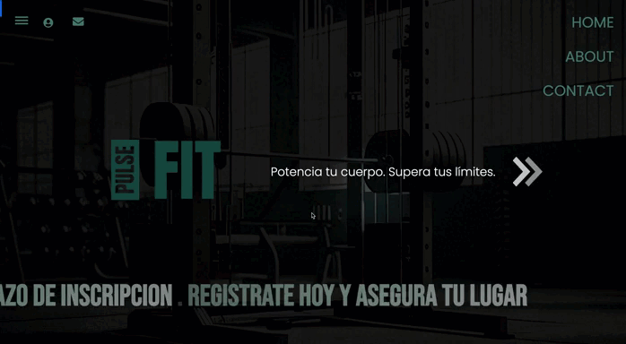

# Django-react_project

Plataforma web para un gimnasio que incluye funcionalidades para gestionar usuarios, reservas de clases, pagos, entre otras. La aplicación utiliza **Django** en el backend y **React** con **Vite** en el frontend, con tecnologías modernas como **JWT** para autenticación, **WebSockets** para chat en vivo y **Celery** para tareas asíncronas.

## 🚀 Tecnologías Utilizadas

### Backend:
- **Django**: Framework para desarrollo web en Python.
- **Django Rest Framework**: Para construir la API RESTful.
- **SQLite**: Base de datos para el almacenamiento de datos.
- **JWT** (JSON Web Tokens): Autenticación basada en tokens usando el paquete **SimpleJWT** en Django.
- **Celery**: Para gestionar tareas asíncronas.
- **WebSockets**: Para funcionalidades de chat en vivo.

### Frontend:
- **React**: Framework para la creación de interfaces de usuario interactivas.
- **Vite**: Herramienta de construcción rápida y optimizada para aplicaciones con React.
- **Tailwind CSS**: Framework CSS para diseño de la interfaz.
- **React Hook Form**: Para la gestión de formularios en el frontend.
- **React Router DOM**: Para la navegación y gestión de rutas en el frontend.
- **Context API**: Para la gestión del estado global de la aplicación.

### Testing:
- **pytest**: Framework de pruebas para realizar testing en el backend.

### Backend:
- **API RESTful** para gestionar usuarios, clases, pagos, etc.
- **Autenticación con JWT** utilizando el paquete **SimpleJWT**.
- **Soporte para tareas asíncronas** usando **Celery** (por ejemplo, para notificaciones o procesos largos).
- **Chat en vivo** utilizando **WebSockets**.
  
### Frontend:
- **UI interactiva** construida con **React** y **Vite**.
- **Formularios dinámicos** usando **React Hook Form**.
- **Navegación** y **rutas** gestionadas con **React Router DOM**.
- **Diseño responsive** con **Tailwind CSS**.

## 🚀 Instalación

### Requisitos previos:
- Python 3.x
- Node.js (para el frontend)
- PostgreSQL (si prefieres usar PostgreSQL en lugar de SQLite)
- Redis (si usas Celery)
  
## 📱 Futuras Expansiones  

En futuras versiones, se implementará una aplicación móvil utilizando **React Native** para extender la plataforma a dispositivos iOS y Android. Esta aplicación permitirá:  

- 📌 **Gestión de reservas y pagos** desde el móvil.  
- 🔔 **Notificaciones en tiempo real** mediante WebSockets y Push Notifications.  
- 🎨 **Interfaz optimizada** para dispositivos móviles con un diseño intuitivo.  

¡Mantente atento a las próximas actualizaciones! 🚀   

